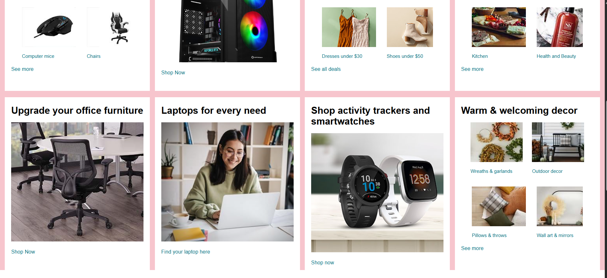
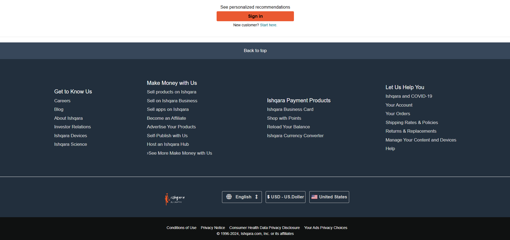

# 🛒 Ishqara Clone (Frontend Only)

A static frontend clone of the Ishqara website built using **HTML** and **CSS**. This project replicates the layout and design of Ishqara's homepage to demonstrate frontend development skills and responsive design practices.

## 🌐 Live Demo

[🔗 View Live](https://parthx-23.github.io/IshqaraeClone/)

## 📸 Screenshots

| Homepage                                |
| --------------------------------------- |
|   |
|  |
|  |

## 🧰 Technologies Used

- **HTML5**
- **CSS3**
- Flexbox & Grid
- Responsive Design (Media Queries)
- Font Awesome (optional for icons)

## 📁 Folder Structure

**Clone this repository**

```bash
git clone https://github.com/your-username/Ishqara.git
cd Ishqara-clone
```
